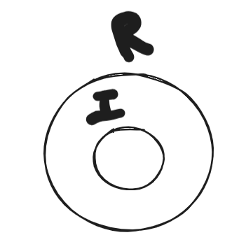

    Seive of Erathoneses
    https://www.geeksforgeeks.org/sieve-of-eratosthenes/

    i * i <= n 
    i <= n/i

    and Averaging will int a and b with 2^30 + 2^30 will result in 2^31 and  the result cant be stored in int;

    Additive Persistence 
    Multiplicative Persistence

    1 2 3 4 5
    120 
    0

Recursion vs Iteration

iteration is a subset of recursion
TC(R) = TC(I)

Searching and Sort
 - Linear Search
 - Binary Search

binary search on 2d matrix

